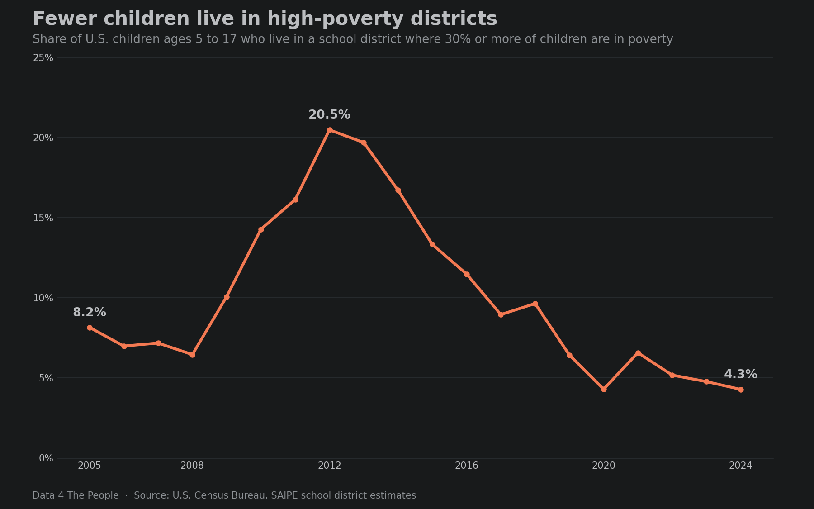

# Child poverty by school district: six takeaways

On Wednesday we rebuilt our [map of child poverty by school district](https://www.data4thepeople.com/p/children-poverty-viz/), which shows the share of school-age children in poverty in every U.S. school district for every year from 2005 to 2024. Here are six of our key takeaways from studying our new and improved tool.

## 1. Next-door districts can be worlds apart

The national rate is one number: 14.4% of children ages 5 to 17 lived in families in poverty in 2024. Inside a single county, the rate can run from a few percent to more than half. The chart below shows the 10 counties with the widest gap between their highest- and lowest-poverty school districts, plus Montgomery County, OH.

Eight of the 10 counties are in Michigan, Ohio, Indiana and Illinois. In most of them, the highest-poverty district is an older city or inner suburb, and the lowest-poverty district is a suburb in the same county. In Montgomery County, OH, home to Dayton, Northridge Local School District is at 37.1% and Oakwood City School District is at 2.2%. Dayton is my hometown, so this stat hits home, and it completely resonates with the experience of visiting these two communities, which, though both are in the Dayton area, may as well be in different countries given the lifestyles of their residents. 

::: spacer

## 2. Far fewer children live in high-poverty districts than a decade ago

We counted the children who live in a school district where 30% or more of children are in poverty. That share more than doubled between 2005 and 2012, then fell to 4.3% in 2024, matching 2020 as the lowest in the 20 years on the map.

The number of districts with 500 or more children and a rate of 30% or more went from 693 in 2005 to 1,424 in 2012 and 444 in 2024. In 2012, 35.6% of all children in poverty lived in one of those districts. In 2024, 10.5% did.

::: spacer

## 3. Big cities improved; child poverty rose in many suburban districts

The chart below compares the 25 school districts with the most children, using three-year pooled rates for 2005 to 2007 and 2022 to 2024 so a single noisy year does not drive the result.

The big-city districts are still among the higher-poverty districts on the list. Philadelphia (26.7%) and Houston (27.3%) remain above every suburban district that rose. The data shows where the rates moved. It does not show why.

::: spacer

## 4. Where it rose most: the industrial Midwest

Among districts with 5,000 or more children, nine of the 15 largest increases were in Ohio, Michigan and the St. Louis area.

Detroit Public Schools Community District, with about 116,000 children, had the largest increase of any district with 50,000 or more children. Several of the others are older suburbs next to a big city: Eastpointe next to Detroit, Euclid next to Cleveland, and Riverview Gardens and Hazelwood in St. Louis County.

::: spacer

## 5. The Mississippi Delta: high child poverty, every year

The Mississippi Delta is the flat, fertile land between the Mississippi and Yazoo rivers in northwest Mississippi. We used the 10 counties the [Mississippi Encyclopedia](https://mississippiencyclopedia.org/entries/delta/) calls the core of the Delta: Bolivar, Coahoma, Humphreys, Issaquena, Leflore, Quitman, Sharkey, Sunflower, Tunica and Washington. Thirteen school districts there have comparable figures for every year from 2005 to 2024.

Twelve of the 13 districts were at 30% or more in all 20 years, and Western Line School District was in 17 of them. Five districts, including Greenwood-Leflore Consolidated and Humphreys County, were above 60% in at least one year.

Our [labor force map](https://data4thepeople.github.io/laus/), built from the Bureau of Labor Statistics' county data, tells a similar story with different data. It sorts every U.S. county by how much its labor force has changed against the same month 20 years earlier. In July 2026, all 10 core Delta counties were in its lowest band, "Structural Loss," down more than 10%. How we built that map is on its [methodology page](https://www.data4thepeople.com/p/labor-force-history-viz).

Since 1990, the Delta's labor force fell 38.8% while Mississippi's grew 10.3% and the nation's grew 35.7%. Child poverty and a shrinking workforce are two measures of the same region. Neither one shows that it caused the other. In our view, together they describe a region that has been left behind for decades: roughly 172,000 people living with that hardship year after year.

::: spacer

## 6. Many more children live just above the line

The map counts children below the official poverty line, $31,812 a year in 2024 for two parents and two children. We wrote about how that line was set, and why it has fallen behind, in [Frozen in 1963](https://www.data4thepeople.com/p/frozen-in-1963/). The Census Bureau's broader measure, the Supplemental Poverty Measure (SPM), counts tax credits and food aid as income, subtracts taxes, work and child care costs and medical bills, and sets its line by local housing costs.

The chart below compares the two for all U.S. children. Each bar is the share of children whose family income (for the SPM, income plus benefits minus key costs) falls in a band measured against their own poverty line. Left of the dashed line are children below the line: under 50% of it is deep poverty, and 50% to 99% is the rest. Right of the dashed line are children above it, starting with families at 100% to 149% and 150% to 199% of the line. Coral bars are the official measure, the one the map uses. Blue bars are the SPM. Each color adds up to about 100%.

The two measures find about the same share of children below the line. They differ just above it. On the official measure, 33.6% of children lived below twice the line in 2024. On the SPM, 49.1% did.

In our view, that means the map likely shows the best-case picture: it counts only children below the official line. Many programs set the line higher. Free school meals and SNAP's federal gross income limit are at 130% of the federal poverty guidelines, and reduced-price school meals and WIC are at 185%. A map of children below one of those lines would be much darker. Sadly, we cannot build that map for every school district reliably yet. The Census Bureau survey that reports it by district, the American Community Survey, disagrees with SAIPE in some districts even below the poverty line, and we want to understand why before we map it. Newer survey data is also on hold. In June 2026, a Commerce Department order ([Departmental Administrative Order 216-26](https://tnsdc.utk.edu/2026/08/13/new-rule-pushes-back-2025-american-community-survey-other-census-bureau-product-releases/)) barred the privacy-protection methods the Census Bureau uses to publish detailed survey tables, and the Bureau [has delayed the 2025 American Community Survey release](https://www.census.gov/programs-surveys/acs/news/updates/2026.html) with no new date.

::: spacer

## See it for your district

<iframe src="https://data4thepeople.github.io/ChildPovertyDistrict/?v=20260930b#embed=1" width="100%" height="780" loading="lazy" style="border:0" title="Child poverty by school district: interactive map, 2005 to 2024"></iframe>

::: spacer 40px

::: divider

::: blurb What this does and does not tell you
- Child poverty rates are the Census Bureau's Small Area Income and Poverty Estimates (SAIPE) for school districts. They are model estimates without district error bars. Single years in small districts can move several points with no real change behind them.
- The official poverty line counts pretax cash income only and is the same everywhere in the country.
- Changes over time use three-year pooled rates and compare each district only with itself on the same boundaries.
- The labor force figures are BLS Local Area Unemployment Statistics for counties, not school districts.
- The full method is on the [map's page](https://www.data4thepeople.com/p/children-poverty-viz/).
:::

::: spacer

## Common questions

### Which school district has the highest child poverty rate?

Among districts with 500 or more children, Helena-West Helena School District, AR had the highest estimate in 2024 (66.5%). Estimates for districts this size can be off by many points, so read it as among the highest, not as an exact rank.

### Is child poverty going down?

Nationally, yes: the official rate for children 5 to 17 was 20.6% in 2012 and 14.4% in 2024, and the share of children living in districts at 30% or more fell from 20.5% to 4.3%. But it rose by 2 points or more in 2,385 school districts between 2005 to 2007 and 2022 to 2024.

### Where is child poverty getting worse?

Among districts with 5,000 or more children, the largest increases were in the industrial Midwest: Youngstown and Warren, OH, Riverview Gardens, MO, and Eastpointe, MI. Detroit had the largest increase among districts with 50,000 or more children.

### Why is child poverty so high in the Mississippi Delta?

The data shows how high it is, not why. The 13 Delta districts with full history were between 38.6% and 51.4% in every year from 2005 to 2024, and the region's labor force fell 38.8% since 1990.

### Is child poverty in the Mississippi Delta getting better?

Only slightly. In the 13 Delta school districts with full history, the rate was 44.8% in 2005, peaked at 51.4% in 2013, and was 43.4% in 2024. It never fell below 38.6% in any year.

### What poverty line does this use?

The official federal poverty line. In 2024 it was $31,812 a year for two parents and two children, and $25,273 for one parent and two children, counting income before taxes.
